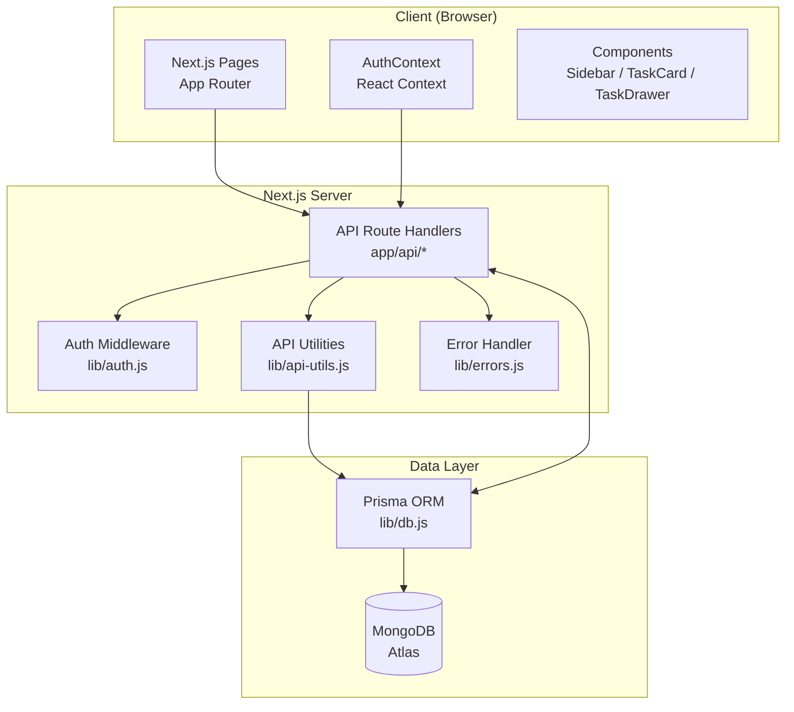
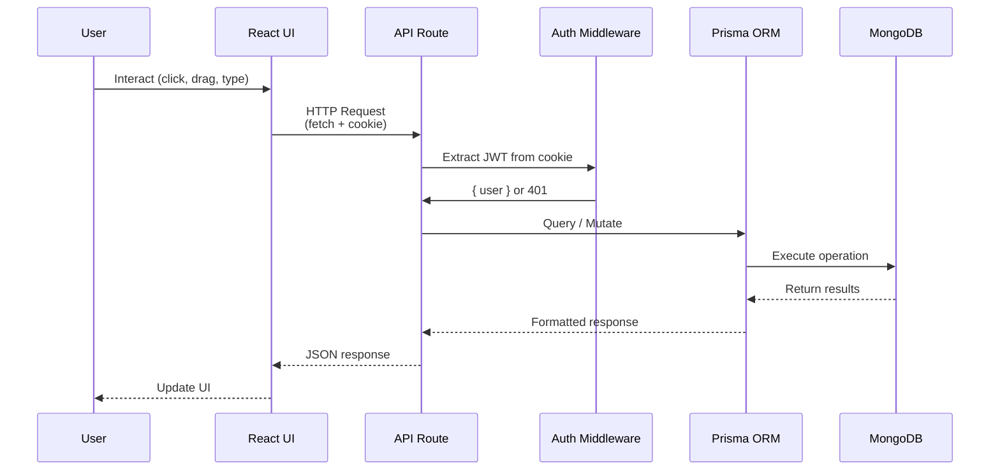
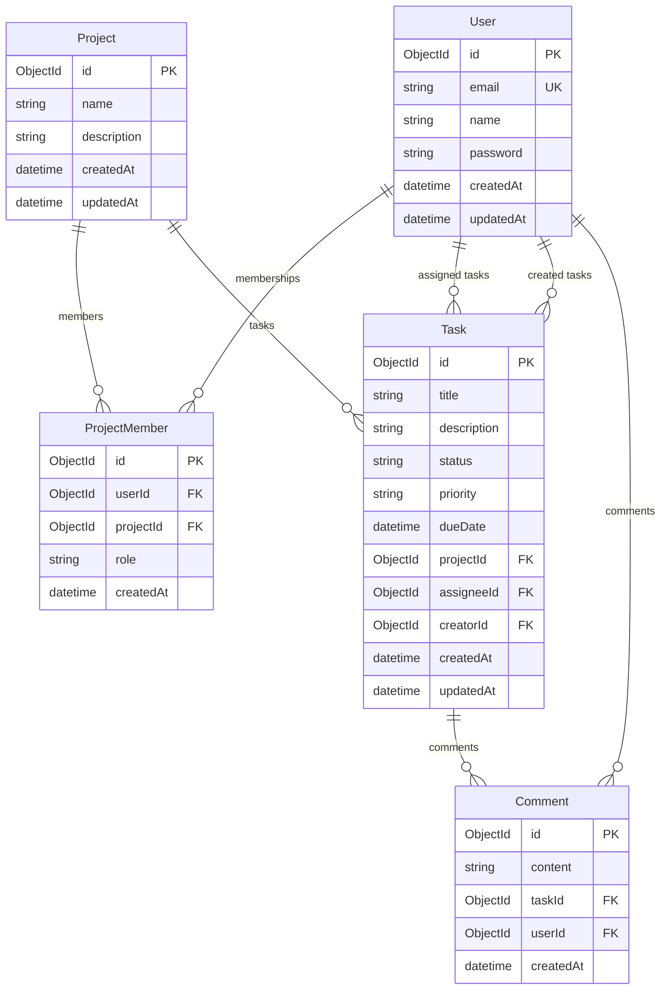
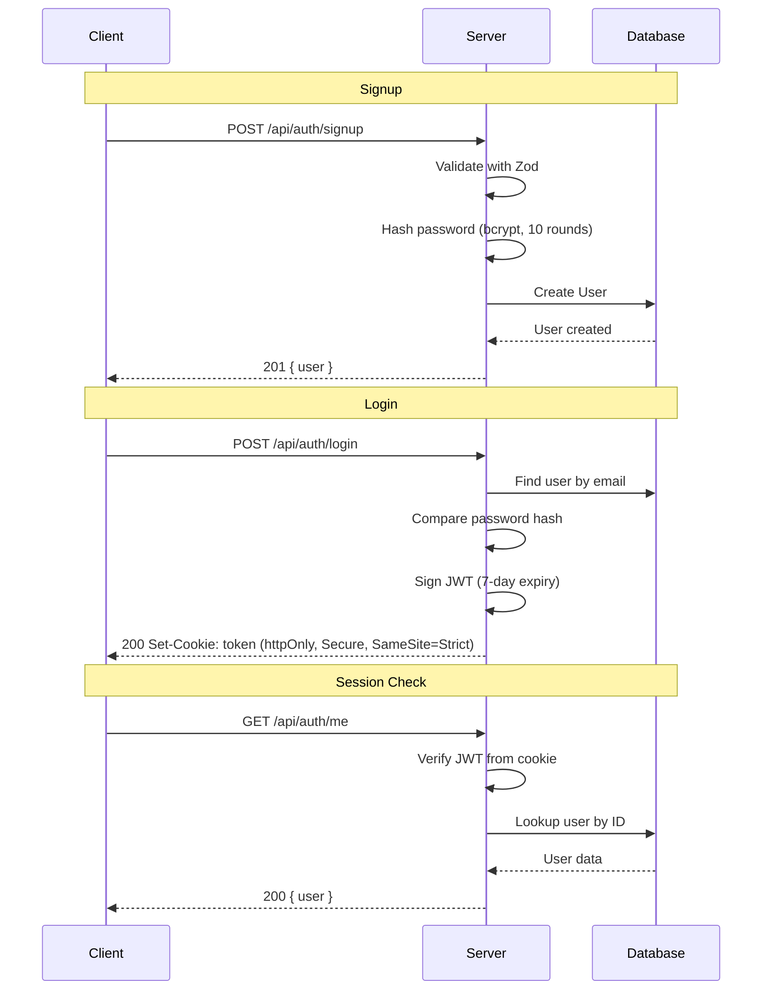
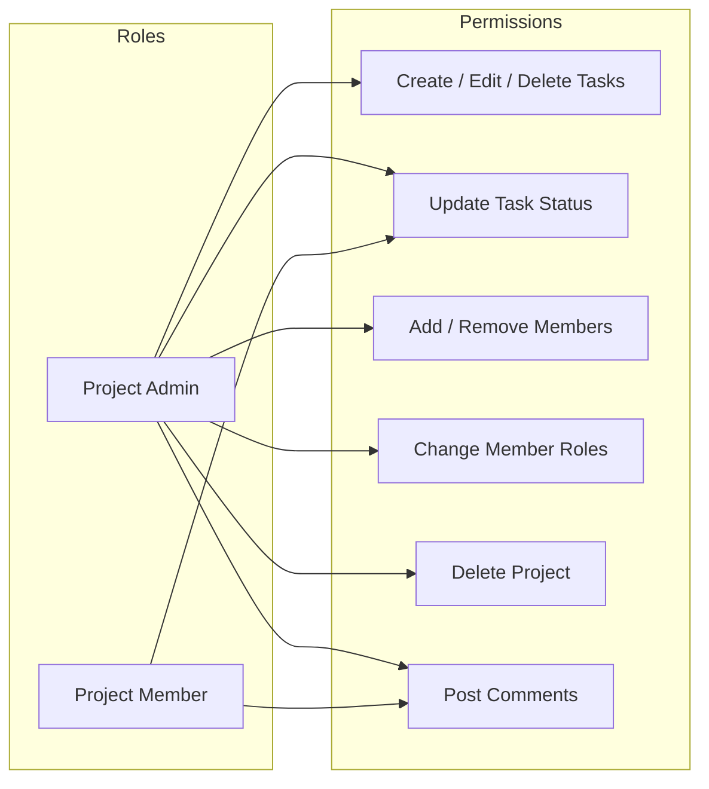

<p align="center">
  <picture>
    <source media="(prefers-color-scheme: dark)" srcset="https://img.shields.io/badge/Aetheria%20Tasks-%23FF6B6B?style=for-the-badge&logo=task&logoColor=white">
    
  </picture>
</p>

<p align="center">
  <strong>A premium full-stack collaborative project & task management workspace for modern teams.</strong>
</p>

<p align="center">
  
  
  
  
  
  
</p>

---

## Overview

**Aetheria Tasks** is a feature-rich Kanban-style task management application that enables teams to create projects, organize work with a drag-and-drop board, manage team members with role-based access, and collaborate through task comments — all wrapped in a glassmorphic dark-theme UI.

---

## Features

- **🔐 Authentication** — JWT-based signup/login/logout with httpOnly cookies & bcrypt password hashing
- **📋 Project Management** — Create, view, and delete projects with per-project team membership
- **👥 Team Management** — Add/remove members, assign roles (Admin / Member), role-based access control
- **📌 Kanban Board** — Four-column board (To Do, In Progress, In Review, Done) with draggable task cards
- **📊 List View** — Tabular task view sortable by status, priority, assignee, and due date
- **💬 Task Comments** — Threaded comments on tasks with user attribution and timestamps
- **📈 Dashboard** — Analytics with stat cards, radial progress charts, and per-project breakdown
- **🎨 Dark Glassmorphic UI** — Premium dark theme with glass effects, smooth animations, and custom design tokens
- **📱 Responsive** — Fixed sidebar layout adapting to content views

---

## Tech Stack

| Layer | Technology |
|-------|-----------|
| **Framework** | [Next.js 16](https://nextjs.org/) (App Router) |
| **UI Library** | [React 19](https://react.dev/) |
| **Styling** | Tailwind CSS v4 + CSS Modules |
| **Database** | MongoDB (via [Prisma 6](https://www.prisma.io/) ORM) |
| **Auth** | JWT (`jsonwebtoken`) + bcryptjs |
| **Validation** | Zod |
| **Icons** | Lucide React |
| **Language** | JavaScript (with `@/` path aliases) |

---

## Architecture

### High-Level System Architecture



### Low-Level Application Flow



### Database Schema (ER Diagram)



### Authentication Flow



### Role-Based Access Control



---

## API Routes

| Method | Endpoint | Auth | Description |
|--------|----------|------|-------------|
| `GET` | `/api/health` | ❌ | Health check (pings MongoDB) |
| `POST` | `/api/auth/signup` | ❌ | Register new user |
| `POST` | `/api/auth/login` | ❌ | Login, returns JWT cookie |
| `POST` | `/api/auth/logout` | ❌ | Clear auth cookie |
| `GET` | `/api/auth/me` | ✅ | Get current user |
| `GET` | `/api/projects` | ✅ | List user's projects |
| `POST` | `/api/projects` | ✅ | Create project |
| `GET` | `/api/projects/:id` | ✅ | Get project details |
| `DELETE` | `/api/projects/:id` | ✅(Admin) | Delete project |
| `POST` | `/api/projects/:id/tasks` | ✅(Admin) | Create task |
| `PATCH` | `/api/tasks/:id` | ✅(Member+) | Update task |
| `DELETE` | `/api/tasks/:id` | ✅(Admin) | Delete task |
| `GET` | `/api/tasks/:id/comments` | ✅(Member+) | List task comments |
| `POST` | `/api/tasks/:id/comments` | ✅(Member+) | Add task comment |
| `POST` | `/api/projects/:id/members` | ✅(Admin) | Add member by email |
| `PATCH` | `/api/projects/:id/members/:memberId` | ✅(Admin) | Change member role |
| `DELETE` | `/api/projects/:id/members/:memberId` | ✅(Admin) | Remove member |

---

## Project Structure

```
├── app/                          # Next.js App Router
│   ├── api/                      # REST API route handlers
│   │   ├── auth/                 #   login, signup, logout, me
│   │   ├── health/               #   health check
│   │   ├── projects/             #   CRUD + members + tasks
│   │   └── tasks/                #   CRUD + comments
│   ├── dashboard/                # Workspace dashboard page
│   ├── login/                    # Login page
│   ├── projects/[id]/            # Project detail (Kanban/List)
│   ├── signup/                   # Signup page
│   └── page.js                   # Landing page
├── components/                   # Reusable React components
│   ├── ErrorBoundary.js
│   ├── Loading.js
│   ├── Modal.js
│   ├── ProjectStats.js
│   ├── ProtectedLayout.js
│   ├── Sidebar.js
│   ├── TaskCard.js
│   └── TaskDrawer.js
├── context/
│   └── AuthContext.js            # Auth state management
├── lib/                          # Shared utilities
│   ├── api-client.js             # Frontend API client
│   ├── api-utils.js              # Server helpers (auth, validation)
│   ├── auth.js                   # JWT / bcrypt utilities
│   ├── db.js                     # Prisma client singleton
│   ├── errors.js                 # Error hierarchy
│   ├── logger.js                 # Structured logger
│   └── project-auth.js           # Role checks
├── prisma/
│   ├── schema.prisma             # Database schema (5 models)
│   └── seed.js                   # Development seed data
├── styles/                       # CSS Modules
│   ├── auth.module.css
│   ├── project.module.css
│   ├── projectstats.module.css
│   ├── sidebar.module.css
│   ├── taskcard.module.css
│   └── taskdrawer.module.css
├── public/                       # Static assets
├── .env.example                  # Environment variable template
└── package.json
```

---

## Getting Started

### Prerequisites

- [Node.js](https://nodejs.org/) 18+
- [MongoDB](https://www.mongodb.com/) Atlas account (free tier) or local MongoDB

### Installation

```bash
# Clone the repository
git clone <repo-url>
cd team-task-manager

# Copy environment variables
cp .env.example .env
```

Edit `.env` with your MongoDB connection string and a JWT secret:

```env
DATABASE_URL="mongodb+srv://<user>:<password>@cluster0.mongodb.net/taskmanager?retryWrites=true&w=majority"
JWT_SECRET="your-strong-random-secret"
NODE_ENV=development
```

Install dependencies and push the schema to the database:

```bash
npm install
```

This runs `prisma generate && prisma db push` automatically via the `postinstall` script.

Seed sample data (optional):

```bash
node prisma/seed.js
```

Start the development server:

```bash
npm run dev
```

Open [http://localhost:3000](http://localhost:3000) in your browser.

---

## Deployment (Railway)

1. Create a Railway project and add a MongoDB add-on or connect an external MongoDB Atlas cluster.
2. Set environment variables in Railway:
   - `DATABASE_URL` — MongoDB connection string
   - `JWT_SECRET` — strong random string
   - `NODE_ENV=production`
3. Railway build command: `npm run build`
4. Railway start command: `npm start`

The `postinstall` hook will automatically generate the Prisma client and push the schema on deploy.

---

## NPM Scripts

| Script | Description |
|--------|-------------|
| `npm run dev` | Start development server |
| `npm run build` | Build for production |
| `npm start` | Start production server |
| `npm run lint` | Run ESLint |
| `npm run prisma:generate` | Generate Prisma client |
| `npm run prisma:db:push` | Push schema to MongoDB |
| `npm run prisma:migrate:dev` | Create migration (dev) |
| `npm run prisma:migrate:deploy` | Apply migrations (prod) |

---

## License

This is a private project. All rights reserved.
